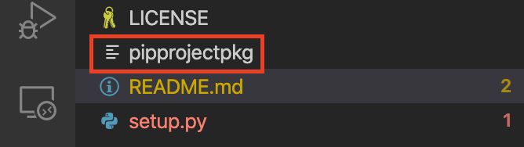
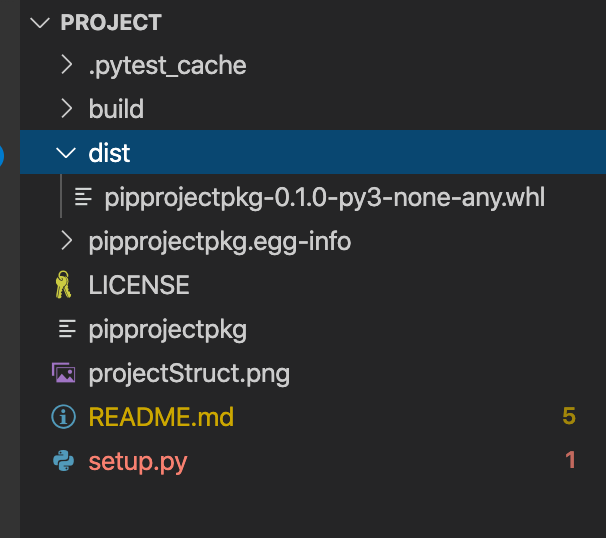

# How to package python project into pip

## prerequisite

- stating the obvious, you need python 3.+ and pip as well
- plus the following packages [setuptools, wheel, tqdm, twine]
- you need an account with pip people to upload there [pypi](https://pypi.org)

## structure

your project structure should be as in the image



It should has a `setup.py`, `readme`, `LICENSE` and YOUR PROJECT files instead of `pipprojectpkg`.
this project already contains a sample of how each file should look like.

## Compile into a package

```bash
python setup.py bdist_wheel 
```

Now you have a local pip package



which you can install using

```bash
pip install dist/pipprojectpkg-0.1.0-py3-none-any.whl
```

## Finally, uplaoding to pypi

- create .pypric file in home directory
  - for windows `C:\users\username\.pypirc`
  - for linux based: `~/.pypirc`

    ```bash
    touch ~/.pypirc
    ```

- update the file content with the below

  ```bash
  [distutils]
  index-servers=pypi
  [pypi]
  repository=https://upload.pypi.org/legacy/
  username=<replace with your username on pypi>
  ```

- upload

  ```bash
  twine upload dist/*
  ```

- now you can install as any pip package using its name only

  ```bash
  pip install pipprojectpkg
  ```
